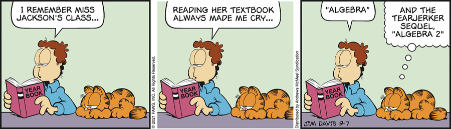

[TOC]

# Today's Comic from Garfield

`Comic` `English` `Garfield`



**yearbook** *noun* /ˈjɪrbʊk/ *(especially North American English)* a book that is produced by the senior class in a school or college, containing photographs of students and details of school activities.

**textbook** *noun* /ˈtekstbʊk/ a book that teaches a particular subject and that is used especially in schools and college.

**algebra** *noun* /ˈældʒɪbrə/ a type of mathematics in which letters and symbols are used to represent quantities.

**tear-jerker** *noun* /ˈtɪr dʒɜːrkər/ a film, story, etc. that is designed to make people feel sad.

**sequel** *noun* /ˈsiːkwəl/ a book, film, play, etc. that continues the story of an earlier one.

*\* Definition of **verb** from the [Oxford Advanced Learner's Dictionary](https://www.oxfordlearnersdictionaries.com/)*

**zh**


---

# 教程 《加菲猫》中文译版

`Comic` `English` `Ps` `Tutorial`

## 一、原作

在[Go Comics](https://www.gocomics.com/garfield/)中获取原作 *ga.gif* 。

```markdown
Tip:

该网站使用Web开发技术，通过将原作的祖先节点的`pointer-events`CSS属性设置为`none`，从而屏蔽原作节点的鼠标事件。因此用户无法直接获取原作。

用户可以通过“开发者工具”-“网络”-“图像”来获取原作。
```

## 二、翻译

在[Oxford Learner's Dictionaries](https://www.oxfordlearnersdictionaries.com/)中查询单词，获取初步译文 *tr '*。

在[百度翻译](https://fanyi.baidu.com/)中翻译语句，修改 *tr ''* 为 *tr ‘’* 。

在[百度](https://www.baidu.com/)中查询本土化表达，修改 *tr ''* 为 *tr* 。

```markdown
Tip:

注意译文的标点符号尽可能与原文保持一致。
```

## 三、修图

重做一份 *ga.gif* ，更名为 *ga.png*。

在[稿定 | 图片编辑](https://www.gaoding.com/image)中登录，打开 *ga.png* ，涂抹气泡文字，导出为 *ga.png* 。

## 四 、嵌字

在[稿定 | 在线PS](https://ps.gaoding.com/#/)中导入 *ga.png* ，将 *tr* 嵌入图片的对应位置，导出为 *ga_zh.png* 。

```markdown
Tip:

嵌字包括`气泡嵌字`与`环境嵌字`。

注意`气泡嵌字`的字体、段落、外边距等尽可能与原作保持一致，采用中间对齐的方式。

注意`环境嵌字`的字体、变形等尽可能与原作保持一致，但字体大小应尽可能小。
```

---

# 有关计算机视觉与计算机图形学的讨论

`Computer Graphics` `Computer Vision`

> 计算机图形学毕业生怎么这么少啊？ - 张心欣的回答 - 知乎 https://www.zhihu.com/question/348123313/answer/850228830

计算机视觉，或者说图像、AI等研究方向的主要目的是希望计算机来理解现实世界。即计算机通过某种方式的学习后，能得到世界运作的客观规律（比如说深度学习的神经网络是其得出的结论模型），再由这些客观规律来预测未来世界，因此我们说，计算机具备理解现实世界的能力。而预测未来世界依靠的客观规律的得出，并不一定靠我们训练计算机，也可以以来人类积累的物理模型、数学方法等的结论。由于深度学习有强大的API，上手容易，因此学生多，但是很多学生并不理解客观世界的物理规律，导致某些项目利用深度学习还不如利用物理规律。比如预测排污源附近的污染物浓度，比起神经网络，扩散-对流仿真往往更合适。星系仿真动画也不需要训练神经网络得到网络表达，直接套用物理规律更简单。

计算机图形学的主要目的是在计算机中再现客观世界。该研究的方法论是首先要找到世界运作的方式，然后找到能被当前计算能力表达的现象，找到合适的计算方法并简化模型，最后是通过高度优化的编程复现出来。因此，其研究范围覆盖物理、应用数学、微分几何、生物科学等等，集成度和跨专业度要求很高，必须要了解事物背后的物理原理和过程。而北美的计算机图形学学科，大多开设在数学系底下，其教授导师不乏应用数学、航空航天、几何物理的方向，CG绝不是单纯的CS学科，编程仅仅是其中一环。

在北美、德国的计算机图形学的就业方向有医疗仪器、渲染研发、影像软件、工业软件、机器人和三维打印设计软件。

> 在中国，只有“游戏开发”是适合相关专业的毕业生的。。。。。。。。然而看看这些游戏， 很难讲它们需要什么CG技术。

---

# Oxford Learner's Dictionaries

`English`

Search [Oxford Advanced Learner's Dictionary](https://www.oxfordlearnersdictionaries.com/).

---

# Ps Online

`Ps`

使用[稿定 | 图片编辑](https://www.gaoding.com/image)与[稿定 | 在线PS](https://ps.gaoding.com/#/)进行在线图片编辑。

---

# Yarn

`Coding` `Yarn` `Package Manager`

Yarn is a package manager.

---

# Algebra Vs. Mathmetics

`Culture`

在美国，"Algebra"和"Mathmetics"是两门课程。

---

# "" VS. 《》

`Culture`

英语地区的作品符号使用 *""* ，中国则是  *《》* 。
